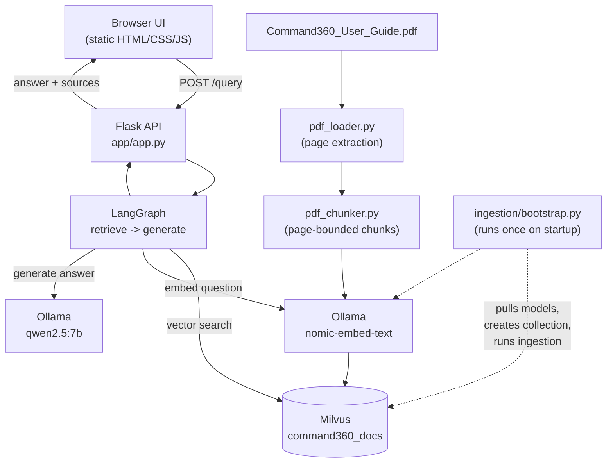

# Command360 Documentation Assistant

PDF-grounded Q&A assistant for the Command360 user guide. Ask a question, get an answer with exact page citations.

## Architecture



All of the above (except the PDF and browser) run as containers via [podman-compose.yml](podman-compose.yml); the `app` container serves both the Flask API and the static frontend.

## Prerequisites

- [Podman](https://podman.io/) (or Docker) installed and running
- [Git](https://git-scm.com/) and [Git LFS](https://git-lfs.com/) installed
- Python 3.11+ (only needed to run `podman-compose` from this repo's virtual environment)

### Installing prerequisites on a fresh server

**Windows (PowerShell, run as Administrator, requires [winget](https://learn.microsoft.com/windows/package-manager/winget/)):**

```powershell
winget install -e --id RedHat.Podman
winget install -e --id Git.Git
winget install -e --id GitHub.GitLFS
winget install -e --id Python.Python.3.11

# Podman needs a Linux VM on Windows - initialize and start it
podman machine init
podman machine start
```

**Linux (Debian/Ubuntu):**

```bash
sudo apt-get update
sudo apt-get install -y podman git git-lfs python3.11 python3.11-venv
```

Close and reopen your terminal after installation so the new commands are on `PATH`.

## Setup from a fresh server

1. **Clone the repository**

   ```powershell
   git clone <repo-url> aten
   cd aten
   ```

2. **Install Git LFS and pull the PDF**

   The Command360 user guide PDF is tracked via Git LFS.

   ```powershell
   git lfs install
   git lfs pull
   ```

3. **Create a Python virtual environment and install `podman-compose`**

   ```powershell
   python -m venv .venv
   .venv\Scripts\Activate.ps1
   pip install podman-compose
   ```

   > **Note:** `requirements.txt` and `requirements.lock.txt` are for the app's Python
   > dependencies, not for this venv (this venv only needs `podman-compose`). Both
   > files target Python 3.11, matching the container image. `requirements.txt` is
   > installed automatically inside the `app` container by the [Dockerfile](Dockerfile)
   > and is all that's needed to run the stack. `requirements.lock.txt` has exact
   > pinned versions — only needed if you want to run scripts directly on your host
   > (outside Docker) against the containers, e.g. `pip install -r requirements.lock.txt`
   > in this same venv.

4. **Build and start the full stack**

   ```powershell
   podman-compose up --build -d
   ```

   This will:
   - Build the app image from the [Dockerfile](Dockerfile)
   - Start `ollama`, `etcd`, `minio`, and `milvus`, waiting for each to become healthy
   - Start the `app` container, which:
     - Waits for Ollama and Milvus to be ready
     - Pulls the `nomic-embed-text` and `qwen2.5:7b` models (first run only, ~5 GB download)
     - Creates the Milvus collection and ingests the PDF (first run only)
     - Starts the Flask API on port `5000`

   First-time startup can take several minutes (model downloads + PDF ingestion). Subsequent `podman-compose up` runs skip model pulling and ingestion since they're already done.

5. **Check progress (optional)**

   ```powershell
   podman logs -f command360-app
   ```

6. **Verify it's ready**

   ```powershell
   curl http://localhost:5000/health
   ```

## Usage

### Web UI

Open [http://localhost:5000/](http://localhost:5000/) in a browser. Type a question and get a
formatted answer with markdown rendering, a distinct citation callout (document name + page
numbers), and a row of source chips for the pages used. Includes a dark/light mode toggle
(persisted in the browser).

The UI is plain HTML/CSS/JS served directly by the Flask app (see [app/templates/index.html](app/templates/index.html),
[app/static/css/style.css](app/static/css/style.css), [app/static/js/app.js](app/static/js/app.js)) —
no separate frontend build step, container, or npm install required.

### API

```powershell
curl -X POST http://localhost:5000/query `
  -H "Content-Type: application/json" `
  -d '{"question":"How do I update an expired certificate?"}'
```

Response:

```json
{
  "answer": "...",
  "sources": [
    { "document_name": "Command360_User_Guide", "page_number": 323 }
  ]
}
```

## Tearing down

```powershell
podman-compose down          # stop containers, keep data (models, indexed collection)
podman-compose down -v       # stop containers and wipe all data (clean slate)
```

## Reindexing the PDF

To force a full reindex (e.g. after replacing the PDF in `documents/confluence/`):

```powershell
podman-compose down -v
podman-compose up --build -d
```
